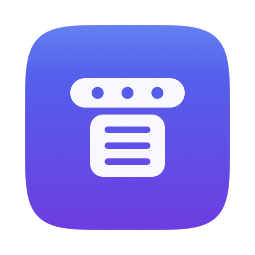
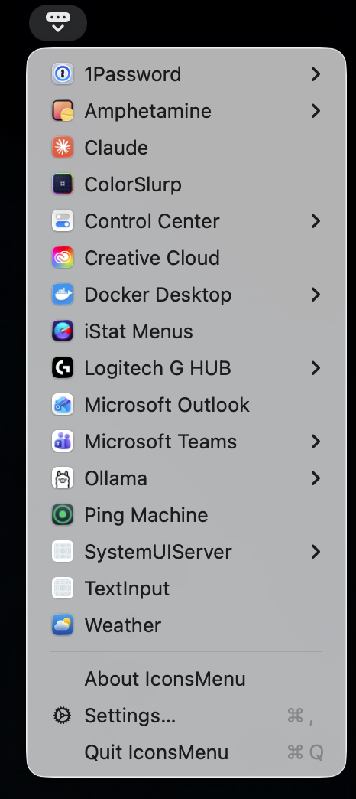

# Icons Menu



A menu bar app that makes every *other* menu bar item reachable, whether or not you can see
it.

The problem it solves: most menu bar utilities are `LSUIElement` apps with no Dock icon, no
main menu and no window to bring forward. Their status item is the only way in. Once the bar
overflows — and with ~20 items it does, especially on a notched display — macOS silently
parks the surplus off-screen and those apps become unreachable. Docker Desktop is the
canonical example.

Icons Menu adds one item to the bar whose dropdown lists every menu bar item on the system by
application name, and reaches them through the Accessibility API rather than by clicking, so
their position on screen stops mattering.

<p align="center">
  
</p>

Rows with a chevron open the application's own menu, mirrored:

```
       Control Center   ▸   Bluetooth
       Docker Desktop   ▸   Clock          ▸  Docker Desktop is running
       iStat Menus          Focus             ──
       Weather          ▸   Sound          ▸  Go to the Dashboard
       …                    Wi‑Fi          ▸  Settings…
                                              Kubernetes Context ▸
```

One flat alphabetical list, one row per *application* rather than per item — an app
contributing several status items collapses into a single submenu. Control Center is the case
that forces this: it alone accounts for seven items.

A row with a mirrorable menu opens it as a submenu, mirrored from the app itself with no rows
invented by us. A row without one is a single click that presses the item, exactly as
clicking its icon would.

(AppKit will deliver an action for a row that *also* has a submenu — contrary to what is
widely assumed, and verified rather than taken on trust — so a row could do both. It is not
wired that way because a row which acts on click and opens on hover is a confusing thing to
aim a pointer at.)

There is deliberately no off-screen/visible distinction. It sounds useful and is not: every
row behaves identically whether or not you can see the icon, so the split conveys nothing
actionable. Settings still notes which applications are off-screen, because there it is
diagnostic rather than decorative.

One row per *application*, not per item: an app contributing several status items collapses
into a single submenu. Control Center is the case that forces this — it alone accounts for
six items, which flat would fill a third of the dropdown with rows all beginning
"Control Center". Grouping happens within a section, so an app with one item off-screen and
the rest visible still surfaces the off-screen one at the top.

## Requirements

macOS 14+, Xcode, and [XcodeGen](https://github.com/yonaskolb/XcodeGen)
(`brew install xcodegen`). Developed against macOS 26.5 and Xcode 26.4.

## Build and run

```sh
make run       # build and relaunch from .build/
make install   # copy to /Applications and run from there — better for daily use
make probe     # inspect the menu bar through the same AX layer the app uses
make icon      # redraw Resources/AppIcon.icns (only when the artwork changes)
```

**Accessibility permission is required**, and the app is useless without it — every app
reports an empty extras menu bar to an untrusted process, so the dropdown would simply be
blank. Icons Menu prompts on first launch and explains itself in the menu until granted.

Note that the project signs ad-hoc, because there is no Developer ID on the development
machine. macOS keys the Accessibility grant to the code signature, so **every rebuild needs
the permission granted again**. `make install` limits the annoyance to deliberate
reinstalls. To stop it entirely, put a real signing identity in `project.yml`.

## Release

```sh
./scripts/build-release.sh
```

Generates the project, builds Release, signs, and packages a DMG into
`builds/<date>-<version>/` alongside a readme for whoever installs it and a SHA-256
checksum. There is no test step because there is no test target.

Signing defaults to ad hoc, which is all this machine can do. If a Developer ID ever
exists, `SIGN_IDENTITY="Developer ID Application: …" ./scripts/build-release.sh` uses it
and prints the two `notarytool` commands that remove the right-click-to-open step for
other people — and, more usefully here, a stable signature is what stops macOS revoking
the Accessibility grant on every build.

### Tagged releases

Pushing a tag builds and publishes the DMG:

```sh
git tag v1.1 && git push origin v1.1
```

`.github/workflows/release.yml` runs the same `scripts/build-release.sh` on a macOS
runner and attaches the DMG, its checksum and the readme to a GitHub release. The version
comes from the tag — `project.yml` does not need bumping, and the build number is the run
number. Both reach the app because `Info.plist` resolves `CFBundleShortVersionString` and
`CFBundleVersion` from the build settings.

No secrets are involved, because signing is ad hoc. That is also the limitation: the
published DMG carries the same right-click-to-open friction as a local build, and the
Accessibility grant has to be given again after installing it.

The workflow has a manual trigger (`workflow_dispatch`) so it can be exercised without
minting a release: it leaves the DMG as a build artefact instead.

## How it works

Three mechanisms, in order of preference:

1. **Enumeration** — each running app's status items are its `AXExtrasMenuBar` children.
   This is per-process, so the owning application is known for free. On macOS 26
   `CGWindowList` attributes every status item window to Control Center instead, which is
   why it is not used here.

2. **Mirroring, without opening anything** — an `NSMenu` attached to a status item is
   exposed as an `AXMenu` child whether or not it is currently open, so its entries can just
   be read, and any one of them activated with `AXPress` directly. No click, no flash, and
   the item's position never enters into it. About a third of items support this.

3. **Plain press** — for the rest (popover-backed, or menus built on demand), `AXPress` on
   the item itself, exactly as clicking it would. Note this one *is* placement-dependent: an
   off-screen item opens its menu anchored to itself, so it may land somewhere awkward.

### Performance

Opening the dropdown takes about 110ms, which took two non-obvious fixes to get to from an
initial 4.7 seconds:

- **Always set a messaging timeout.** Without `AXUIElementSetMessagingTimeout`, every read
  uses a system default of several seconds, and any process that does not answer promptly
  stalls the caller for all of it. Two of Mail's WebKit content processes accounted for 64%
  of the original scan time. Bounding messages at 100ms found *exactly* the same items.
- **Scan concurrently.** These are round trips to ~150 separate processes, so the cost is
  almost entirely waiting. `DispatchQueue.concurrentPerform` halved what was left.

Do **not** try to speed this up by skipping background-only apps. Around 60 of the ~150
running processes are `.prohibited` and none of them look like they could own a menu bar
item, but one of them does, and filtering them loses it.

### Never touch AX while a menu is open

This is the single most important constraint in the app, and it took three attempts to get
right. Every AX call is synchronous cross-process IPC that pumps the run loop; making one
from inside `NSMenu`'s tracking loop re-enters that loop and AppKit can abandon tracking. The
symptom is the dropdown flickering open and immediately shut.

Three designs that each looked reasonable and each failed:

1. **Load submenus asynchronously, fill them when the data arrives.** Mutates a menu that is
   already on screen — same dismissal, different route.
2. **Load submenus synchronously in `menuNeedsUpdate`.** Only 1–3ms per menu, but it is AX
   IPC during tracking. Reproducible on Amphetamine, whose menu is the largest at 17 entries
   with 6 nested submenus.
3. **Read everything in the background, but scan on demand if the cache is cold.** Fixed the
   common case and left a cold path that did ~250ms of scanning during tracking. This is the
   subtle one: the first open of a session blinked, that open warmed the cache, and the
   second press worked — which reads like a random glitch rather than a code path.

What works: the scan reads every item's full menu tree on a background queue, and building
the menu is pure local `NSMenuItem` construction from that cache — no AX, and nothing
mutated after display. A warm-up timer keeps the cache populated (retrying until
Accessibility is granted, since nothing notifies you when it is), and refreshes happen from
`menuDidClose`, one run loop turn later so AppKit has finished tearing the menu down.

The cost is that menu contents can be one refresh cycle stale — Docker's running/stopped line
may lag a scan. A correct menu that occasionally lags beats a fresh one that dismisses itself.

### Other details worth knowing, both of which cost real debugging time:

- `AXUIElementPerformAction` on a menu-opening item **does not return until that menu
  closes** — the app sits in a nested menu tracking loop and cannot reply. It reports
  `kAXErrorCannotComplete` (−25204) even though the press succeeded. So the return value is
  not a success signal, and the call must never run on the main thread.
- Control Center reports one **zero-size placeholder child per module you have not enabled**
  — 13 of its 19 children on the development machine. They are not hidden items and are
  filtered out by size.

## Staying reachable

Icons Menu is subject to the same overflow it exists to solve, so:

- It **pins itself rightmost**. `NSStatusItem Preferred Position` is a distance from a fixed
  right-hand anchor — measured across running items, `x + position` is constant — so the
  app seeds `0` on first launch and lands as far right as the bar allows, immediately left
  of Control Center. That makes it the last third-party item to ever be pushed off. The
  value is only seeded when absent, so dragging the icon somewhere else sticks.
- It registers a system-wide hotkey — **⌃⌥M** by default — which pops the menu at the
  pointer. This is the actual guarantee: on a narrow or notched display even the rightmost
  item can be pushed off, and an unreachable Icons Menu would defeat the whole point.

  The combination is recorded in Settings. Carbon has no way to ask whether one is free, so
  the recorder finds out the only way available: it registers the candidate, sees whether
  that succeeded, and releases it again before the real registration goes in. A combination
  another app already owns is refused with a message rather than accepted into a shortcut
  that silently does nothing. It insists on ⌃, ⌥ or ⌘ — a system-wide ⇧A would eat the
  letter everywhere.

## Settings

One row per application, with a switch that keeps it out of the dropdown. Hiding is keyed to
the **bundle ID**, not to item ids: an item's ordinal shifts as its app adds or drops items,
so a saved set of item ids would quietly start hiding the wrong thing. It also matches how
the menu groups, so one switch covers all seven of Control Center's items.

The hidden set is applied while the menu is being rebuilt, which happens on every open — so
a switch takes effect immediately, with nothing to invalidate and no reload to trigger.

The list used to be an inventory inspector: an "Open" button per item, each item's x
position, a separate section for off-screen ones. That was a second, worse view of what the
dropdown already shows, so the switch replaced it; off-screen survives as a caption because
it is genuinely diagnostic. **Show all** in the footer exists for one specific case — an app
that has since quit is still hidden, and has no row to switch back on.

## Launch at login

Settings has an **Open Icons Menu at login** switch. It registers the app itself through
`SMAppService.mainApp` — no helper bundle, no `LaunchAgents` plist.

macOS keys the registration to the bundle it was made from, which matters more here than
usual: switch it on for the copy in `/Applications`, because a build in `.build/` registers
*that* path and quietly stops opening once the next build replaces it.

Turning the entry off in System Settings → General → Login Items leaves the service
`.requiresApproval` — registered, not running. The switch reports that state and offers a
link to the pane, rather than flipping back with no explanation. It also re-reads whenever
the window appears or the app is activated, since nothing notifies an app when its login
item is changed out from under it.

## The icon

Drawn in code, in `Sources/Core/IconArtwork.swift` — no image assets in the repo beyond the
generated `.icns`. The mark is a menu bar strip holding three items with a dropdown hanging
below it, on a superellipse plate (much closer to the shape macOS uses than a plain rounded
rectangle, since the corners ease in rather than meeting an arc).

At 32pt and below the mark drops to two shapes, a solid strip and a chevron, because the
three items smear into one white blob and the dropdown's rows disappear entirely. Detail that
cannot be resolved is worse than no detail — it reads as blur rather than as a smaller
version of the same icon.

The menu bar item uses the same motif, drawn separately for 18pt as a **template** image so
macOS tints it — black on a light menu bar, white on a dark one, inverted while the menu is
open. Scaling the coloured artwork down would ignore all of that and look wrong beside every
other item in the bar.

Four candidates were rendered at true size in both light and dark bars before choosing. The
one that reads best keeps the full motif — strip, three items, chevron — rather than the
two-shape reduction the app icon falls back to below 32pt. At 18pt the items still resolve,
and dropping them landed too close to the stock `ellipsis.rectangle` to be worth drawing.

## Layout

```
Sources/Core/         AXAttributes      AX wrappers; nil rather than errors
                      StatusItem        one item + its identity and reachability
                      StatusItemScanner enumeration, filtering, display naming
                      ItemActivator     pressing and mirroring
                      IconArtwork       the app icon, drawn in CoreGraphics
Sources/IconsMenu/    IconsMenuApp      LSUIElement entry point, permission gate
                      MenuController    the status item and its dropdown
                      GlobalHotkey      Carbon RegisterEventHotKey wrapper
                      HotkeyRecorder    records a shortcut, checks it is free
                      LaunchAtLogin     SMAppService login item registration
                      Preferences       hidden apps and the hotkey, in UserDefaults
                      SettingsView      the app list and its switches
Sources/axprobe/      main              CLI over the same core, for debugging AX
Sources/iconforge/    main              renders the .icns; run via `make icon`
```

## Not implemented

- **Hiding items from the menu bar itself.** Settings hides applications from *this app's*
  dropdown; their icons stay exactly where they were in the bar. Removing them from the bar
  is a different problem, and macOS offers exactly one mechanism — an `NSStatusItem`
  expanded to ~10,000pt, pushing everything to its left off-screen — which hides a
  *contiguous run*, not an arbitrary selection. Hiding a specific set means reordering the
  bar with synthesised ⌘-drag events, which is the fragile part of Bartender and Ice and
  what broke Ice on Tahoe. Deliberately skipped: with Icons Menu, an overflowing bar no
  longer costs you access, which removes most of the reason to hide anything.
